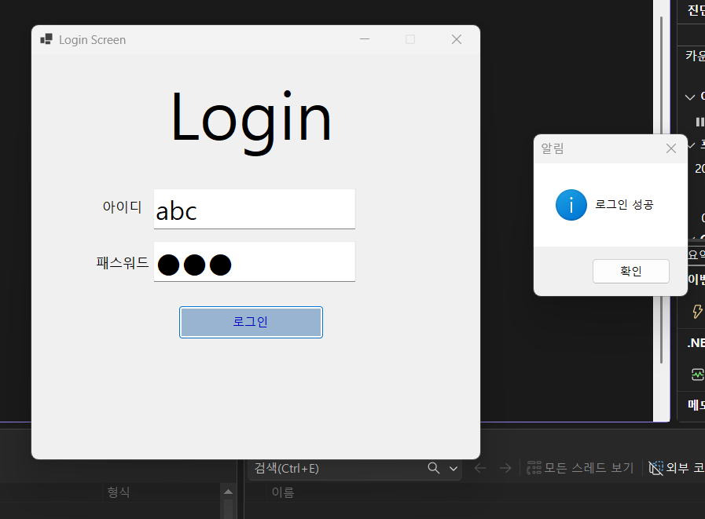

# (C# 코딩) 로그인 스크린

## 개요
- C# 프로그래밍 학습
- 1줄 소개 : 아이디와 비밀번호를 입력받아 로그인하는 간단한 콘솔 애플리케이션
- 사용한 플랫폼 : C#, .NET Windows Forms, Visual Studio, GitHub
- 사용한 컨트롤 : TextBox, Button, Label
- 사용한 기술과 구현한 기능 : 
  - 사용자 입력 처리 : TextBox 컨트롤을 사용하여 아이디와 비밀번호를 입력받음
  - 로그인 검증 : Button 클릭 이벤트에서 입력된 아이디와 비밀번호를 검증하여 로그인 성공 여부를 판단
  - 피드백 제공 : Label 컨트롤을 사용하여 로그인 결과에 대한 피드백 메시지를 표시

## 실행 화면(과제 1)
- 과제 1 코드의 실행화면 스크린샷
- 
- 과제 내용
  - Label, TextBox, Button 컨트롤을 사용하여 로그인 화면을 구현
  - Placeholder 기능을 TextBox에 구현하여 사용자에게 입력 안내 제공
  - 아이디와 패스워드 처리기능 구현
  - 로그인 실패, 성공에 따른 피드백 메시지 표시

- 구현한 내용과 기능 설명
  - TextBox 컨트롤에 Placeholder 기능을 구현하여 사용자가 입력해야 할 내용을 안내
  - Button 클릭 이벤트에서 아이디와 패스워드를 검증하여 로그인 성공 여부를 판단
  - Label 컨트롤을 사용하여 로그인 결과에 대한 피드백 메시지를 표시